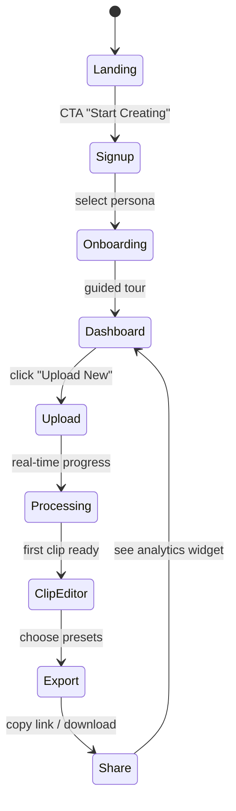

# 02 – Personas & Journeys

_Last updated: 2025-06-12_

## 2.1 Primary Personas

| Persona | Demographic | Goals | Pain Points | Quote |
|---------|------------|-------|-------------|-------|
| Indie YouTuber | 19–28 y/o, 50k–250k subs | Publish Shorts daily to grow channel | Manual editing in Premiere takes 3-4 hrs, hates captions syncing | “I just want my long rant turned into 3 viral clips by tonight.” |
| Educator / Coach | 30–45 y/o, course creator | Convert webinars into lesson snippets | Outsourcing editors is costly, inconsistent brand style | “My audience only watches 30-sec highlights, not 2-hr Zooms.” |
| Podcaster | 25–38 y/o, weekly show | Promote each episode on socials | Audio ↔ video transformation, audiograms, captions | “Listeners scroll past audiograms without subtitles.” |
| Agency Editor | 24–35 y/o, video agency | Batch process 20+ client videos/week | Clip detection at scale, need API & bulk exports | “Speed and consistency trump artistry for client reels.” |

## 2.2 Empathy Maps (Summary)
* **Think & Feel:** Creativity, time pressure, desire for audience growth.
* **See:** Competing creators posting daily, YouTube Studio analytics.
* **Say & Do:** “Uploading new vlog tomorrow”, batch record on weekends.
* **Pain:** Editing drudgery, algorithm changes, cost of tooling.
* **Gain:** Faster publishing, higher engagement, brand consistency.

## 2.3 Customer Journey – Golden Path

KPIs at each stage:
Stage | Metric | Target
----- | ------ | ------
Landing | Visitor → Sign-up | ≥10 %
Signup | Sign-up → First Upload | ≥70 %
Processing | Upload → Clip Ready | ≥90 % success
ClipEditor | Clip Ready → Export | ≥80 %
Export | Export → Share | ≥60 % share within 24 h

## 2.4 Edge & Recovery Paths
1. **Upload Cancel** – user can delete in Dashboard; job flagged `cancelled` in DB.
2. **Whisper Fail** – auto-retry 3×; user toast with “Retry Now”.
3. **Credit Overage** – modal upsell + Stripe Checkout.
4. **Manual Caption Edit** – inline editor commits patch to DB row, triggers re-burn.

## 2.5 Onboarding Flow (First-Time)
Step | Screen | Purpose
---- | ------ | -------
1 | Persona picker | Tailor tips & defaults
2 | Credits intro | Explain minutes system
3 | Tour overlays | Highlight Upload + Dashboard widgets
4 | Upload tutorial | Demo drag-drop + progress UI

## 2.6 Retention Hooks
• Weekly email report with top performing clip.  
• In-app 'New preset' suggestions from trending templates.  
• Badge streak for consecutive week uploads (gamification).

---

> **Persona-first:** All UI copy should speak to creators' desire for speed and growth, avoiding technical jargon. 