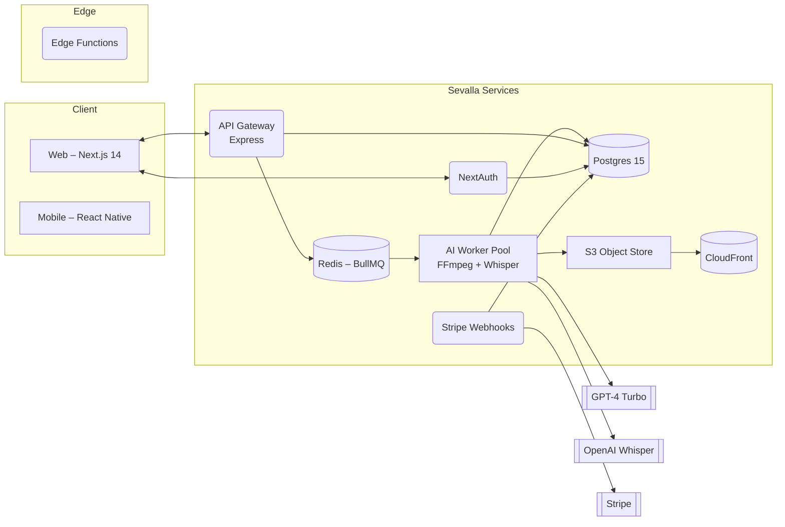

# 03 – System Architecture

_Last updated: 2025-06-12_

## 3.1 Overview Diagram

## 3.2 Tech Stack
Layer | Technology | Rationale
----- | ---------- | ---------
Frontend | Next.js 14 (App Router, RSC) | Seamless SSR + React ecosystem
Design System | Tailwind CSS + Radix UI + Framer Motion | Rapid theming, accessibility, animation primitives
Mobile | React Native + Expo | Code sharing with web components
API | Express + Joi | REST endpoints with schema validation
Auth | NextAuth (JWT) | Built-in providers, secure JWT, refresh tokens
Queue | BullMQ on Redis | Reliable job orchestration, repeatable jobs
Worker | Node.js + Python (Whisper) + FFmpeg CLI | GPU-friendly processing, isolate AI cost
DB | PostgreSQL 15 | Relational consistency, JSON support, extensions
Object Storage | S3-compatible (Sevalla add-on) | Pre-signed uploads, lifecycle rules
Billing | Stripe Checkout & Webhooks | PCI compliance via redirect
Observability | Vector → Loki for logs, Prometheus + Grafana for metrics | Centralised, inexpensive

## 3.3 Service Responsibilities
Service | Responsibility | Scaling
------- | -------------- | -------
Web (apps/web) | Public pages, authenticated dashboard | Auto-scale to 4 instances (CPU 70 %)
API Gateway | Express handlers, presigned URLs, credits check | Auto-scale 2–6 instances
Auth | Session issuance, refresh, OAuth callback | 2 replicas (stateless)
Worker | Whisper transcription, GPT-4 calls, FFmpeg slicing | 0–8 replicas based on queue lag
Billing | Stripe webhook validation, credits top-up | 1 replica (low traffic)

## 3.4 Data Flow (Happy Path)
1. Creator uploads a file via pre-signed PUT to S3.
2. Frontend calls `upload.complete` → API deducts minutes, enqueues `transcribe` job.
3. Worker downloads file → Whisper → saves transcript to S3 + DB.
4. Worker enqueues `clip` job → GPT-4 highlight detection → FFmpeg slices clips.
5. Worker stores clips in S3, writes `clips` rows → enqueues `captions` job.
6. Worker prompts GPT-4 for captions per clip → writes `captions` rows.
7. WebSocket channel `user:<id>` streams status updates to UI.

## 3.5 Failure & Retry Strategy
Job | Retry Policy | Back-off | Poison Queue
----|--------------|----------|-------------
Transcribe | 3 | 5 s → 30 s → 5 min | `transcribe_dead`
Clip | 2 | 10 s → 2 min | `clip_dead`
Caption | 2 | 20 s → 3 min | `caption_dead`
Export | 1 | 30 s | manual review

Dead-letter queues surfaced on Admin dashboard. Alerts to Slack if dead queue length > 5.

## 3.6 Security Posture
• Signed JWT (HS512) with 30-day rotation.  
• S3 objects use 24-h presigned GET/PUT.  
• FFmpeg runs in sandboxed Docker image (no privilege).  
• Rate limiting: 100 API req/min/user via Redis token bucket.

---

> **Design tenet:** Keep compute-intensive AI tasks off the request path; UI must remain <200 ms latency for 95 % of routes. 