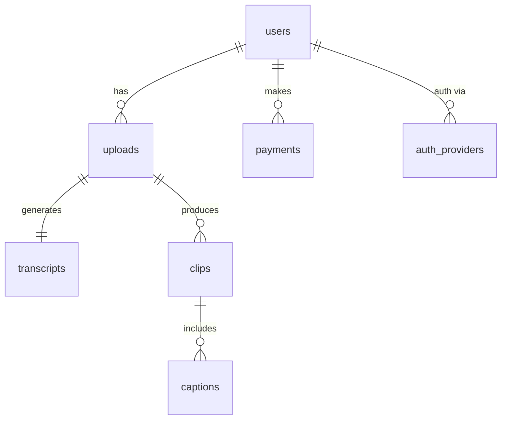

# 04 – Data Model

_Last updated: 2025-06-12_

## 4.1 Entity–Relationship Diagram


## 4.2 Table Schemas (PostgreSQL)
```sql
CREATE TABLE users (
  id           UUID PRIMARY KEY DEFAULT gen_random_uuid(),
  email        TEXT UNIQUE NOT NULL,
  pass_hash    TEXT NOT NULL,
  plan         TEXT NOT NULL CHECK (plan IN ('free','solo','pro','agency')),
  credits      INTEGER NOT NULL DEFAULT 0,
  avatar_url   TEXT,
  created_at   TIMESTAMPTZ DEFAULT now()
);

CREATE TABLE auth_providers (
  id           UUID PRIMARY KEY DEFAULT gen_random_uuid(),
  user_id      UUID REFERENCES users(id) ON DELETE CASCADE,
  provider     TEXT NOT NULL,
  provider_id  TEXT NOT NULL,
  UNIQUE(provider, provider_id)
);

CREATE TABLE uploads (
  id           UUID PRIMARY KEY DEFAULT gen_random_uuid(),
  user_id      UUID REFERENCES users(id) ON DELETE CASCADE,
  src_url      TEXT NOT NULL,
  duration     INTEGER NOT NULL, -- in seconds
  size_mb      INTEGER,
  status       TEXT NOT NULL CHECK (status IN ('pending','processing','done','errored','cancelled')),
  created_at   TIMESTAMPTZ DEFAULT now()
);

CREATE TABLE transcripts (
  id           UUID PRIMARY KEY DEFAULT gen_random_uuid(),
  upload_id    UUID REFERENCES uploads(id) ON DELETE CASCADE,
  language     TEXT,
  text_url     TEXT,
  vtt_url      TEXT,
  words        INTEGER,
  created_at   TIMESTAMPTZ DEFAULT now()
);

CREATE TABLE clips (
  id           UUID PRIMARY KEY DEFAULT gen_random_uuid(),
  upload_id    UUID REFERENCES uploads(id) ON DELETE CASCADE,
  start        INTEGER NOT NULL, -- second offset
  end          INTEGER NOT NULL,
  url          TEXT,
  thumb_url    TEXT,
  status       TEXT NOT NULL CHECK (status IN ('processing','ready','errored')),
  created_at   TIMESTAMPTZ DEFAULT now()
);

CREATE TABLE captions (
  id           UUID PRIMARY KEY DEFAULT gen_random_uuid(),
  clip_id      UUID REFERENCES clips(id) ON DELETE CASCADE,
  platform     TEXT NOT NULL,
  caption_text TEXT NOT NULL,
  locale       TEXT DEFAULT 'en',
  created_at   TIMESTAMPTZ DEFAULT now()
);

CREATE TABLE payments (
  id           UUID PRIMARY KEY DEFAULT gen_random_uuid(),
  user_id      UUID REFERENCES users(id) ON DELETE CASCADE,
  stripe_id    TEXT NOT NULL,
  minutes      INTEGER NOT NULL,
  amount       INTEGER NOT NULL, -- cents
  currency     TEXT NOT NULL DEFAULT 'usd',
  created_at   TIMESTAMPTZ DEFAULT now()
);
```

## 4.3 Index Strategy
```sql
CREATE INDEX uploads_user_idx   ON uploads(user_id);
CREATE INDEX clips_upload_idx   ON clips(upload_id);
CREATE INDEX payments_user_idx  ON payments(user_id);
```

## 4.4 Data Retention Policy
Resource | Retention | Details
-------- | --------- | -------
Raw uploads | 30 days | Auto S3 lifecycle transition to Glacier Deep Archive
Clips | 1 year | Renewable by user download
Logs | 90 days | Vector + Loki; aggregated metrics kept forever

## 4.5 GDPR – Right to be Forgotten
`DELETE /api/account/delete` triggers:
1. Flag user row `pending_delete = true`.
2. Background job purges S3 objects, DB cascades.
3. Audit log entry in `logs` table with redacted user ID.

---

> **Tip:** Keep foreign keys CASCADE to prevent orphaned records, but never cascade deletes from `users` without an explicit GDPR request. 