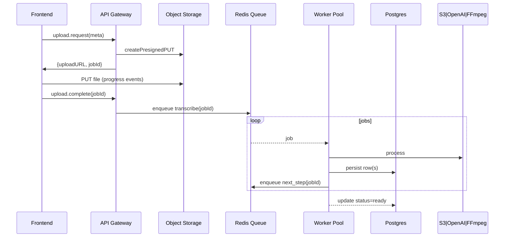

# 05 – Workflows

_Last updated: 2025-06-12_

This document describes each end-to-end workflow in XClips.ai: the jobs, events, status codes, UI updates, and failure handling. Use it when updating workers, queue logic, or UI progress indicators.

## 5.1 Upload → Publish Pipeline

Pipeline Stages | Worker Script | Avg. Duration | Output Tables | WS Event
--------------- | ------------- | ------------- | ------------- | --------
transcribe | `worker/transcribe.py` | 1× video length | `transcripts` | `transcribed`
clip | `worker/clip.js` | 20–60 s | `clips` | `clipped`
caption | `worker/caption.js` | 4–8 s / clip | `captions` | `captioned`
export | `worker/export.js` | 5–15 s / clip | S3 object | `ready`

## 5.2 Credit & Billing Logic
1. Worker streams token counts (`whisper_tokens`, `gpt_tokens`) to API via BullMQ events.
2. API calculates `providerCost = (tokenCount * providerRate)`.
3. `userCharge = providerCost * 7` and is converted to **minutes** (`userCharge / $0.05`).
4. Deduct minutes from `users.credits`. If insufficient → 402 Payment Required + prompt top-up.

> Example: 1-minute clip = 1 800 Whisper tokens (cost $0.006) + 800 GPT tokens (cost $0.012) → providerCost $0.018 → userCharge $0.126 → 3 creator minutes (rounded up) deducted.

## 5.3 WebSocket Channels
Channel | Description | Payload Example
------- | ----------- | ---------------
`user:<uid>:jobs` | Job status updates | `{jobId, stage, pct, etaSec}`
`user:<uid>:credits` | Credit balance changes | `{minutesRemaining}`

## 5.4 Admin & Support Workflows
### Refill Credits (Manual)
1. Owner clicks "Refill" in Admin dashboard.
2. `POST /admin/credits/add` with `{userId, minutes}`.
3. API inserts row in `payments` with `stripe_id = 'admin-refill'`.
4. Server emits WS update.

### Ban User
1. POST `/admin/users/ban` with `{userId, reason}`.
2. API sets `users.plan = 'banned'`, invalidates JWTs.
3. Worker cancels active jobs.

## 5.5 Error Handling Matrix
Error | Recovery | User Feedback
----- | -------- | -------------
Whisper 429 | Retry after 60 s, max 3 | Toast + spinner continues
FFmpeg exit ≠ 0 | Mark clip `errored`, continue others | Warning badge on clip card
OpenAI timeout | Exponential back-off 3x | Toast after final fail
Redis down | API falls back to in-memory queue (dev only) | 500 – UI full-screen error

---

> **Rule:** Every pipeline stage must be idempotent – re-running on the same `jobId` should yield identical outputs or perform upserts. 