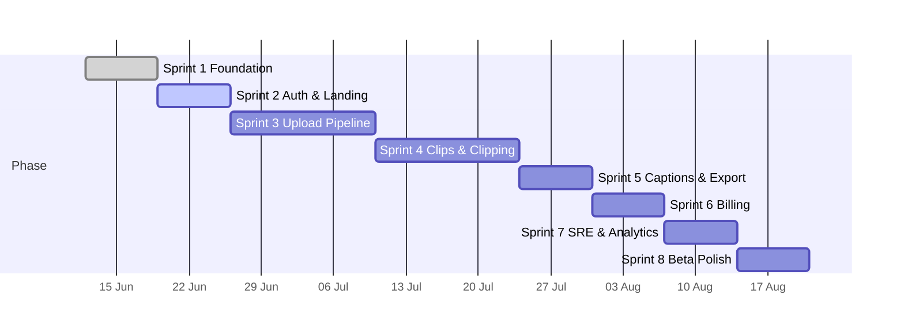
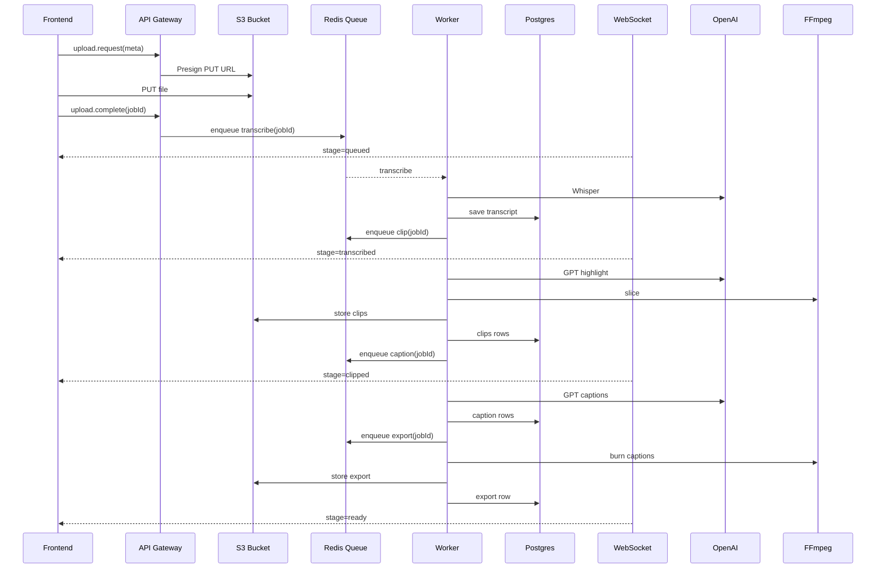
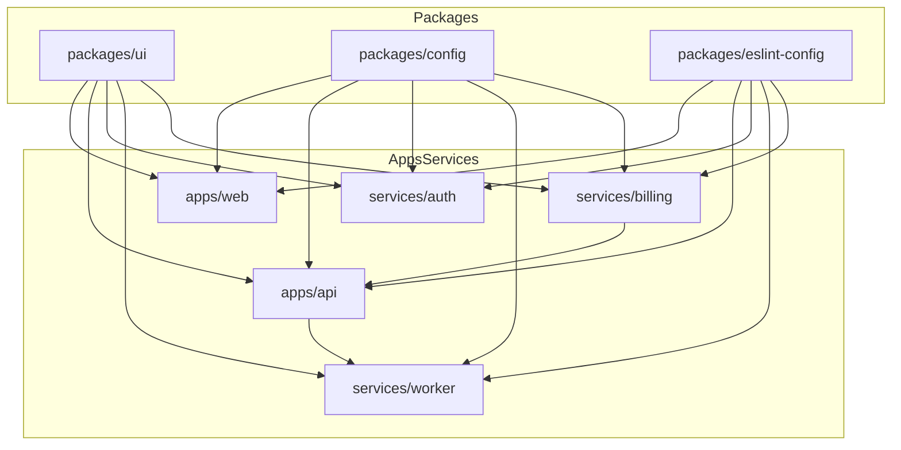
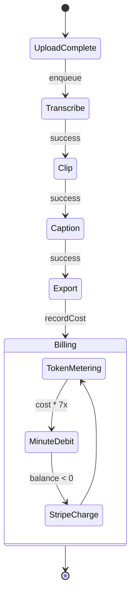

# XClips.ai – Architecture & Workflow Diagrams

## 1. High-Level System Architecture
```mermaid
flowchart LR
  subgraph Frontend
    FE[Next.js 14 Web App]
    RN[React-Native Shell]
  end
  subgraph Edge
    EDGE[Edge Functions / ISR]
  end
  subgraph Backend
    API[tRPC API Gateway]
    AUTH[NextAuth Service]
    BILLING[Stripe Webhook Svc]
  end
  subgraph Async
    REDIS[(Redis Queue)]
    WORKER[Worker Pool\n(FFmpeg + GPT + Whisper)]
  end
  subgraph Data
    PG[(Postgres)]
    S3[S3 Object Storage]
    PROM[(Prometheus / Grafana)]
  end
  OpenAI[[OpenAI GPT-4 & Whisper]]
  Stripe[[Stripe]]

  FE -- JWT --> AUTH
  FE -- RPC --> API
  API -- SQL --> PG
  API --> REDIS
  REDIS --> WORKER
  WORKER -- SQL --> PG
  WORKER -- Files --> S3
  WORKER -- API --> OpenAI
  WORKER -- Metrics --> PROM
  API -- WS/SSE --> FE
  BILLING --> PG
  BILLING --> Stripe
  S3 --> FE
```

## 2. Sprint Timeline vs Blueprint


## 3. Upload-to-Publish Sequence


## 4. Package Dependency Graph


## 5. Event & Billing State Machine
